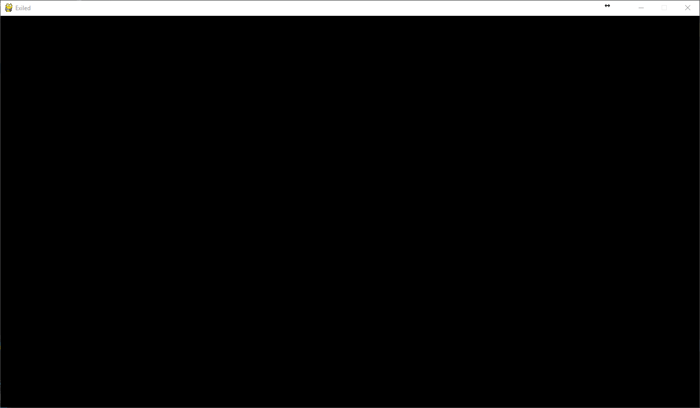
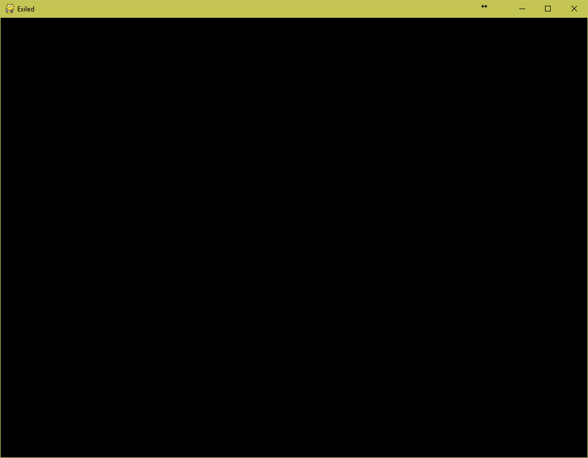

Project Pygame: 1st Year University Game Project
================================================

**Pygame:** A 2D platformer game submitted as a 1st year project. The main protagonist is a human that navigates levels with a bow (grappling hook). 

**Pygame Reborn:** Remake of Pygame as a personal side-project. This approach and hence the work in this directory has been abandoned in favour for using Gamemaker. 

|          Pygame (Original)      |              Pygame (Remake)            |
:--------------------------------:|:----------------------------------------:
    |    |
-----------------------------------------------------------------------------

Key Features
============
- Implementation of a finite state machine for the protagonist's controls.
- Implementation of a mini physics engine.
- Implementation of some elements of random generation.
- Created own pixel artwork manually.

Authors
=======
Othman Alikhan, oz.alikhan@gmail.com
